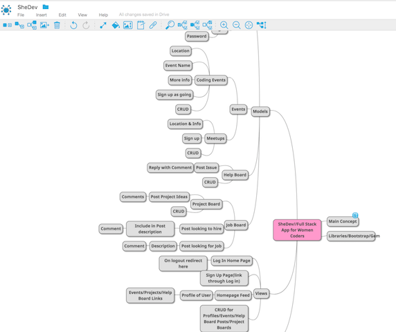

 
SheDev is a social web based platform built to foster the community of women in the development field. 

You can access SheDev  [here](https://shedev.herokuapp.com/).

### Information about SheDev Devlopment:
	
	
SheDev was created through Ruby on Rails, version 		'2.3.3'.

It is hosted on Heroku, and is therefore a postgreSQL database. 

Image support is through paperclip gem and Amazon S3. 
	
There are 4 models within the database, at this protyping level:
		
	* Sessions Model (Login & Logout)
		*User Model (CRUD & RESTful)
			*Post Model (CRUD & RESTful)
				*Comment Model (CRUD & RESTful)
				

		
Currently Users are able to create new posts in three different categories:
		
		 * Events
		 * Jobs
		 * Help Board

The are able to edit/delete posts they create, and are also able to upload a relevant image to the post.

Users have the ability to comment on posts. A comment thread is available in each show view of a post, and only if you either, own the comment or own the post are you able to delete the comment. If you own the comment you are able to edit the content.  

### Wireframing, Trello, & Mindmapping

 					  User Profile Wireframe  
 			

 			
 			
						Post Index Wireframe

![Post Index Wireframe]
(app/assets/images/postsindex.png)

					
						Post Show Wireframe
					
![Post Show Wireframe]
(app/assets/images/postView.png)

### Trello

  [Page Link](https://trello.com/b/fsOnwiEQ/wdi-project-2-shedev)
  
### Google Mindmap 
  
  
  

### User Stories

### Future Additions

* SheDev will have the ability for users to connect with one another through a "friending" relationship. 
* SheDev users will be able to send and receive private messages. 
* SheDev will allow users to search for specific users, by post topic, and by tags. 

### Bugs

* Using Bootstrap & Bootswatch, I had issues deploying specific CSS changes that would persoanlize the app as I intended it to be. 

* When creating a new account, users are directed to log in after, rather than automatically be logged in. I would change that with more time. 

* Though unlikely, users can navigate to the sign in page & create new user page even when they are logged in, and I want to prevent that with future authorization changes. 

* I would like users to be able to post multiple pictures in posts and as of now they can only post one. 

* Users are not notified when someone comments on their posts and that needs to be changed. 

### Credit

*Bootstrap CSS 

*Bootswatch theme "Spacelab"

*PicsArt Photoshop Mobile App for creating logos

